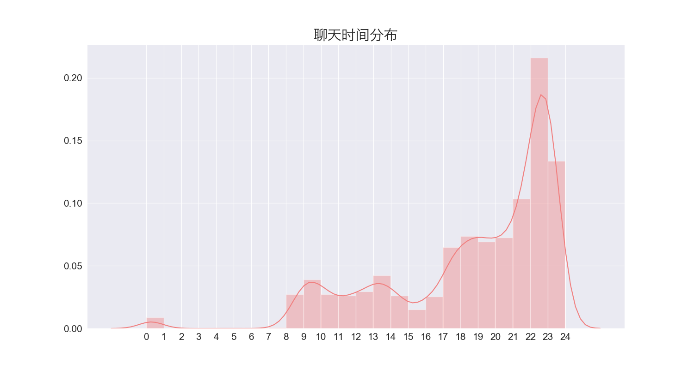

## [AnnualLoveReport](https://dysaniazzz.github.io/AnnualLoveReport/)

模仿网易云音乐的年度恋爱报告，数据来源于微信聊天，报告极度虐狗，请谨慎打开。

> 参考链接

* [AnnualCodeReport](https://github.com/Norcy/AnnualCodeReport)
* [微信数据库解密](https://liujingyuan.top/2018/09/14/%E5%BE%AE%E4%BF%A1%E6%95%B0%E6%8D%AE%E5%BA%93%E8%A7%A3%E5%AF%86/)
* [如何备份微信的聊天记录？](https://www.zhihu.com/question/19924224/answer/69982884)
* [爱情大数据 | 你的专属微信聊天记录统计](https://blog.csdn.net/iphilo/article/details/79052325)
* [Python + wordcloud + jieba 十分钟学会生成中文词云](https://blog.csdn.net/fontthrone/article/details/72782971)
* [从安卓手机ROOT提取微信聊天记录到利用Python进行词云分析全过程](https://blog.csdn.net/u011938325/article/details/78988089)

